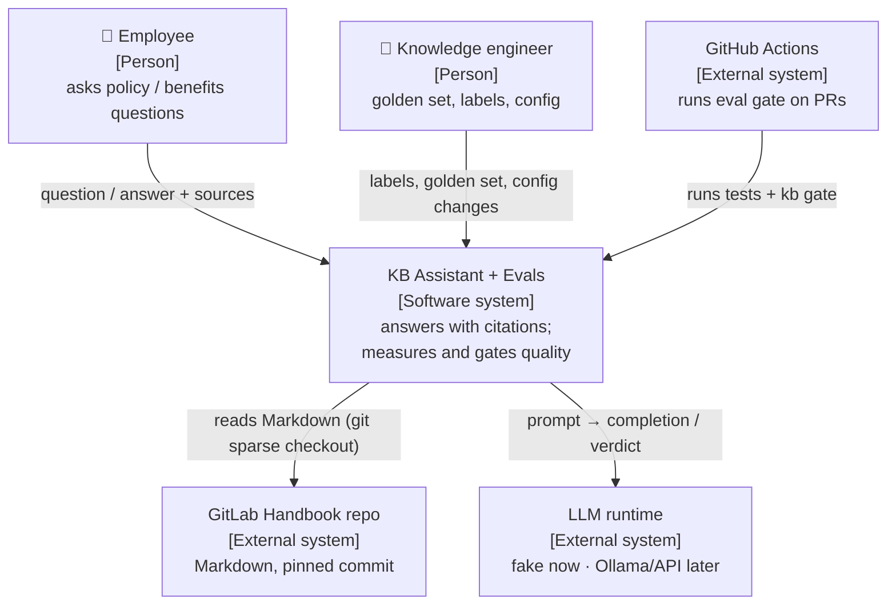

# C4 Level 1: System context

```mermaid
flowchart TB
  emp["👤 Employee<br/>[Person]<br/>asks policy / benefits questions"]
  ke["👤 Knowledge engineer<br/>[Person]<br/>golden set, labels, config"]
  sys["KB Assistant + Evals<br/>[Software system]<br/>answers with citations;<br/>measures and gates quality"]
  docs["GitLab Handbook repo<br/>[External system]<br/>Markdown, pinned commit"]
  llm["LLM runtime<br/>[External system]<br/>fake now · Ollama/API later"]
  ci["GitHub Actions<br/>[External system]<br/>runs eval gate on PRs"]

  emp -- "question / answer + sources" --> sys
  ke -- "labels, golden set, config changes" --> sys
  sys -- "reads Markdown (git sparse checkout)" --> docs
  sys -- "prompt → completion / verdict" --> llm
  ci -- "runs tests + kb gate" --> sys
```
