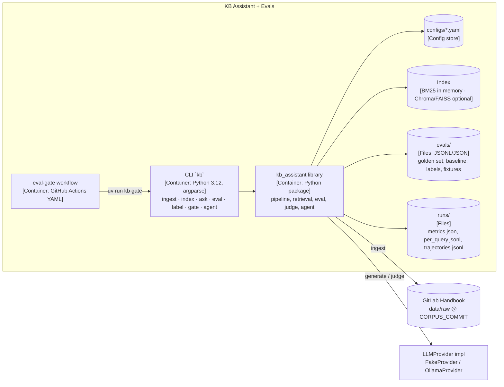

# C4 Level 2: Containers

```mermaid
flowchart LR
  subgraph sys["KB Assistant + Evals"]
    cli["CLI `kb`<br/>[Container: Python 3.12, argparse]<br/>ingest · index · ask · eval · label · gate · agent"]
    lib["kb_assistant library<br/>[Container: Python package]<br/>pipeline, retrieval, eval, judge, agent"]
    cfg[("configs/*.yaml<br/>[Config store]")]
    idx[("Index<br/>[BM25 in memory · Chroma/FAISS optional]")]
    ev[("evals/<br/>[Files: JSONL/JSON]<br/>golden set, baseline, labels, fixtures")]
    runs[("runs/<br/>[Files]<br/>metrics.json, per_query.jsonl, trajectories.jsonl")]
    wf["eval-gate workflow<br/>[Container: GitHub Actions YAML]"]
  end
  docs[("GitLab Handbook<br/>data/raw @ CORPUS_COMMIT")]
  llm["LLMProvider impl<br/>FakeProvider / OllamaProvider"]

  cli --> lib
  lib --> cfg
  lib --> idx
  lib --> ev
  lib --> runs
  lib -- "ingest" --> docs
  lib -- "generate / judge" --> llm
  wf -- "uv run kb gate" --> cli
```
