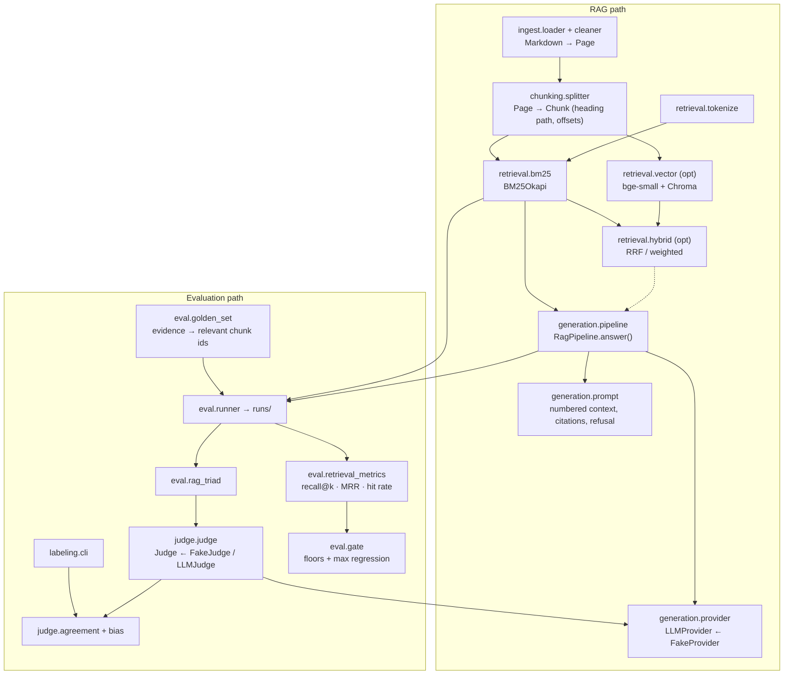

# C4 Level 3: Components (RAG + evaluation)

```mermaid
flowchart TB
  subgraph rag["RAG path"]
    loader["ingest.loader + cleaner<br/>Markdown → Page"]
    splitter["chunking.splitter<br/>Page → Chunk (heading path, offsets)"]
    tok["retrieval.tokenize"]
    bm25["retrieval.bm25<br/>BM25Okapi"]
    vec["retrieval.vector (opt)<br/>bge-small + Chroma"]
    hyb["retrieval.hybrid (opt)<br/>RRF / weighted"]
    prompt["generation.prompt<br/>numbered context, citations, refusal"]
    prov["generation.provider<br/>LLMProvider ← FakeProvider"]
    pipe["generation.pipeline<br/>RagPipeline.answer()"]
  end
  subgraph evalp["Evaluation path"]
    gold["eval.golden_set<br/>evidence → relevant chunk ids"]
    rm["eval.retrieval_metrics<br/>recall@k · MRR · hit rate"]
    triad["eval.rag_triad"]
    judge["judge.judge<br/>Judge ← FakeJudge / LLMJudge"]
    agree["judge.agreement + bias"]
    label["labeling.cli"]
    runner["eval.runner → runs/"]
    gate["eval.gate<br/>floors + max regression"]
  end

  loader --> splitter --> bm25
  tok --> bm25
  splitter --> vec
  bm25 --> hyb
  vec --> hyb
  bm25 --> pipe
  hyb -.-> pipe
  pipe --> prompt
  pipe --> prov
  gold --> runner
  bm25 --> runner
  pipe --> runner
  runner --> rm
  runner --> triad --> judge --> prov
  label --> agree
  judge --> agree
  rm --> gate
```
