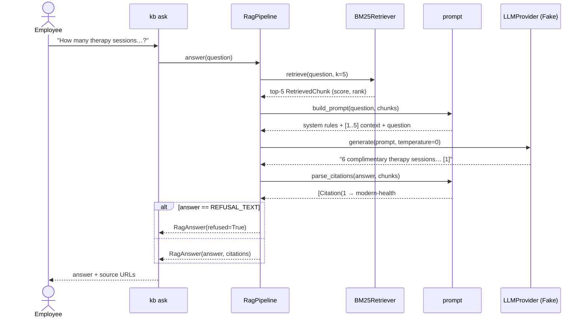

# Sequence: answering a question

```mermaid
sequenceDiagram
  actor U as Employee
  participant CLI as kb ask
  participant P as RagPipeline
  participant R as BM25Retriever
  participant PR as prompt
  participant L as LLMProvider (Fake)
  U->>CLI: "How many therapy sessions…?"
  CLI->>P: answer(question)
  P->>R: retrieve(question, k=5)
  R-->>P: top-5 RetrievedChunk (score, rank)
  P->>PR: build_prompt(question, chunks)
  PR-->>P: system rules + [1..5] context + question
  P->>L: generate(prompt, temperature=0)
  L-->>P: "6 complimentary therapy sessions… [1]"
  P->>PR: parse_citations(answer, chunks)
  PR-->>P: [Citation(1 → modern-health#3, url)]
  alt answer == REFUSAL_TEXT
    P-->>CLI: RagAnswer(refused=True)
  else
    P-->>CLI: RagAnswer(answer, citations)
  end
  CLI-->>U: answer + source URLs
```
