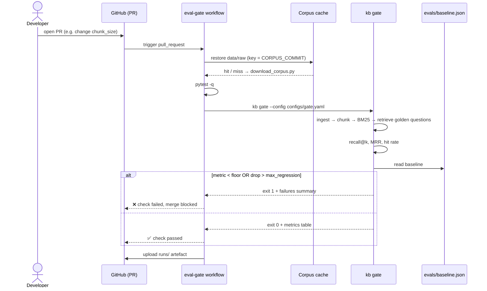

# Sequence: CI eval gate

```mermaid
sequenceDiagram
  actor D as Developer
  participant GH as GitHub (PR)
  participant WF as eval-gate workflow
  participant C as Corpus cache
  participant K as kb gate
  participant B as evals/baseline.json
  D->>GH: open PR (e.g. change chunk_size)
  GH->>WF: trigger pull_request
  WF->>C: restore data/raw (key = CORPUS_COMMIT)
  C-->>WF: hit / miss → download_corpus.py
  WF->>WF: pytest -q
  WF->>K: kb gate --config configs/gate.yaml
  K->>K: ingest → chunk → BM25 → retrieve golden questions
  K->>K: recall@k, MRR, hit rate
  K->>B: read baseline
  alt metric < floor OR drop > max_regression
    K-->>WF: exit 1 + failures summary
    WF-->>GH: ❌ check failed, merge blocked
  else
    K-->>WF: exit 0 + metrics table
    WF-->>GH: ✅ check passed
  end
  WF->>GH: upload runs/ artefact
```
